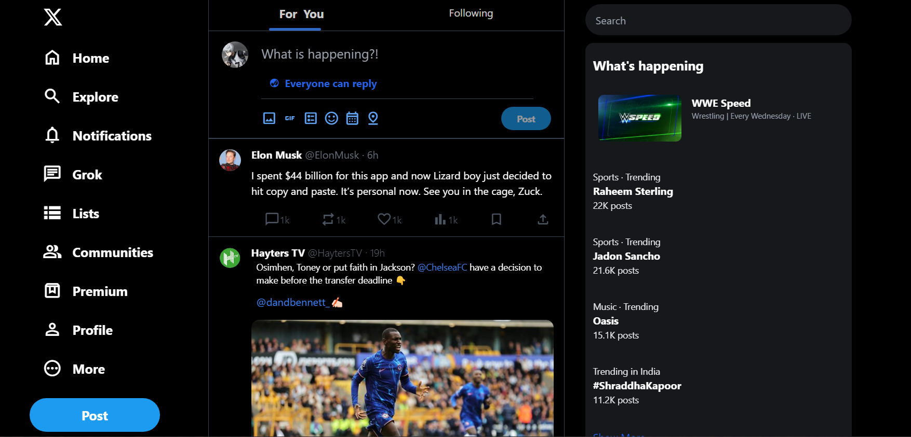
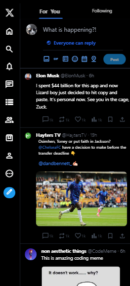

# Twitter (X) Clone

This repository contains the source code for a Twitter (X) clone built using Tailwind CSS and HTML. The project replicates the basic UI of Twitter's home page and is fully responsive, providing a seamless user experience across different devices.

## Live Demo

Check out the live demo of the project [here](screenshots/livedemo.mp4).

## Features

- **Responsive Design**: The website is fully responsive and adapts to various screen sizes, ensuring a consistent user experience on desktops, tablets, and mobile devices.
- **Modern UI**: Mimics the clean and modern interface of Twitter's home page, using Tailwind CSS for styling.

## Screenshots

  

